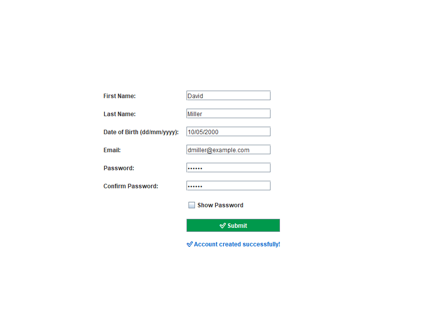

# AccountProject

A simple Java-based GUI application for creating a new account with input validation and automated testing using JUnit. This project uses **Java Swing** for the user interface and **GitHub Actions** for Continuous Integration (CI).

## 📋 Features

- ✅ Form validation for:
  - First Name and Last Name (only letters, minimum 2 characters)
  - Email format (e.g., user@example.com)
  - Password and Confirm Password (minimum 6 characters, must match)
  - Date of Birth (format: dd/mm/yyyy)
- ✅ Responsive and user-friendly Swing interface
- ✅ Real-time feedback on form submission
- ✅ Unit tests using JUnit 5
- ✅ GitHub Actions CI workflow for automatic compilation and test execution

## 🗂️ Project Structure

```

AccountProject/
│
├── .github/workflows/
│   └── test.yml              # GitHub Actions workflow for CI
│
├── images/
│    └── screenshot.png
│
├── lib/
│   └── junit-platform-console-standalone-1.9.0.jar  # JUnit 5 runner
│
├── src/
│   ├── Account.java          # Validation logic
│   ├── AccountForm.java      # Swing UI
│   └── AccountTest.java      # Unit tests
│
└── README.md
````

## 🚀 Getting Started

### Prerequisites

- Java 17 or above
- Git
- (Optional) An IDE like IntelliJ IDEA or Eclipse

### Running the Application

To launch the GUI form:

```bash
javac -cp lib/junit-platform-console-standalone-1.9.0.jar -encoding UTF-8 src/*.java
java -cp src AccountForm
````

### Running Tests Manually

```bash
javac -encoding UTF-8 -cp ".;lib\junit-platform-console-standalone-1.9.0.jar" src\Account.java src\AccountForm.java src\AccountTest.java
java -jar lib\junit-platform-console-standalone-1.9.0.jar --classpath src --select-class AccountTest

```

## 🔁 CI/CD with GitHub Actions

Every `push` and `pull_request` triggers the GitHub Actions workflow defined in `.github/workflows/test.yml`. The workflow:

1. Checks out the repository
2. Sets up Java 17
3. Compiles the source files
4. Runs the JUnit tests using the JUnit Console Launcher

## 📷 Screenshots

Here is a screenshot of the account creation form




